# Fundamentos de Linux - Avaliação Final

<aside>
💡

Curso: UFCD 0836 - Linux - Instalação e configuração

Formando: Pedro Dias

</aside>

---

# Parte 1:

> Submissão de Prints de Configuração (10 valores)
> 

## 1. a)

> Coloque um print da configuração de IP fixo no servidor Ubuntu no ficheiro `/etc/netplan/*.yaml`.
> 

Etapas:

Primeiro, listar a pasta /etc/netplan e depois fazer cat ao(s) ficheiro(s) encontrado(s).

```bash
ls -l /etc/netplan
cat /etc/netplan/50-cloud-init.yaml
sudo cat /etc/netplan/50-cloud-init.yaml
```

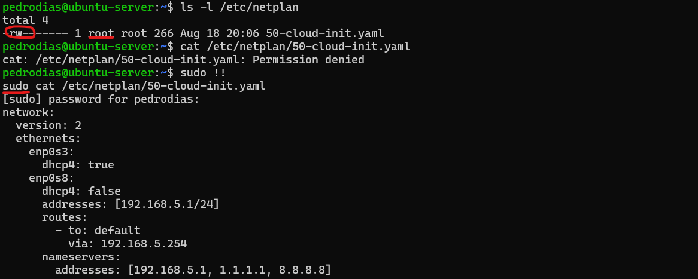

## 1. b)

> Envie uma captura de ecrã do ficheiro `/etc/bind/named.conf.local`, mostrando a configuração de uma zona DNS.
> 

```bash
ls -l /etc/bind/named.conf.options
cat /etc/bind/named.conf.options
```

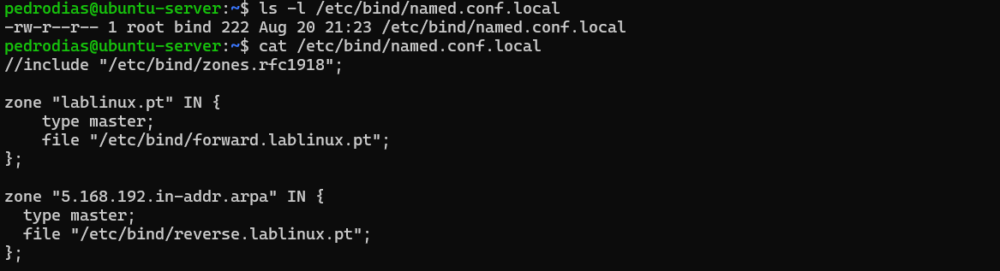

## 1.c)

> Apresente um print do resultado do comando dig <nome do domínio> realizado no servidor Ubuntu, comprovando a resolução de nomes.
> 

```bash
dig ubuntu-server ubuntu-server.lablinux.pt
```

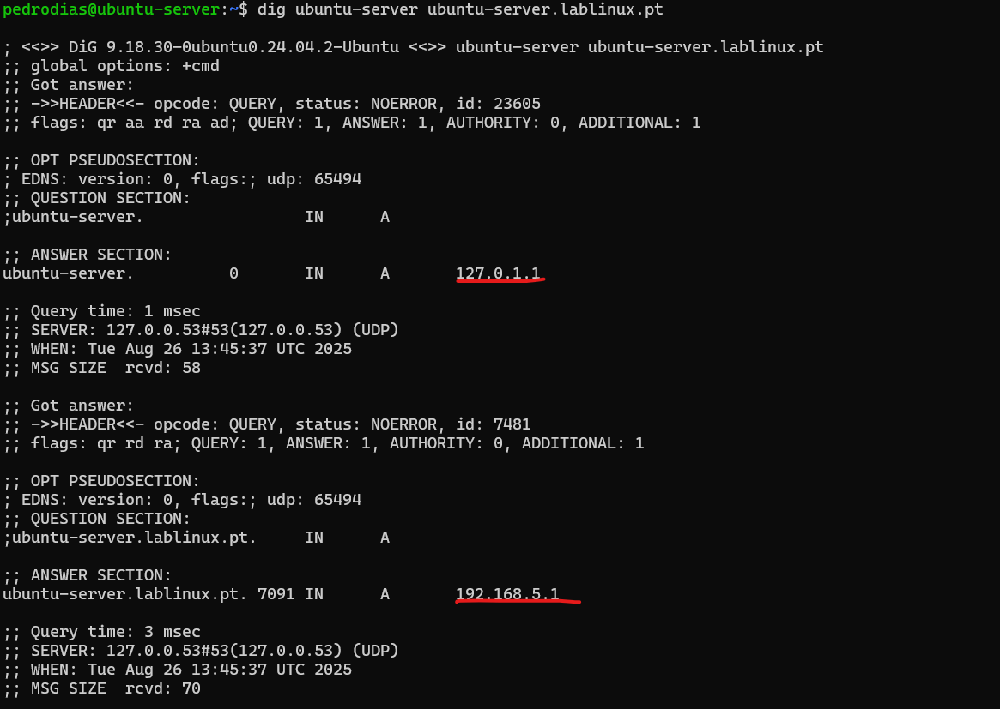

## 1.d)

> Submeta uma captura de ecrã do ficheiro de configuração do serviço DHCP no Ubuntu Server, mostrando a configuração no ficheiro `/etc/dhcp/dhcpd.conf`.
> 

```bash
ls -l /etc/dhcp/dhcpd.conf
cat /etc/dhcp/dhcpd.conf
```

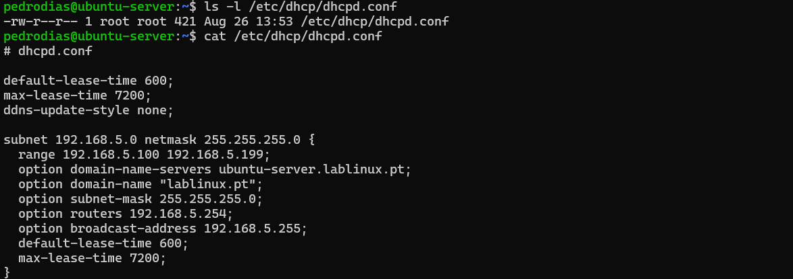

## 1.e)

> Mostre a configuração da firewall UFW, incluindo um print dos comandos utilizados para permitir conexões específicas.
> 

```bash
sudo ufw reset
sudo ufw enable
sudo ufw allow 22
sudo ufw allow 53
sudo ufw allow 80
sudo ufw allow 443
sudo ufw status numbered
```

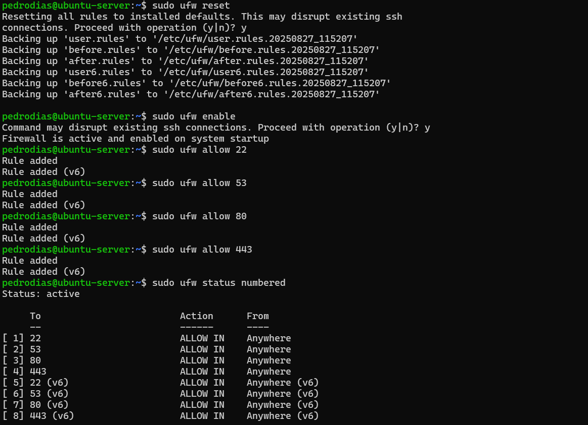

A ponderar se é importante registar as atividades da firewall com 

```bash
ufw logging on
tail -f /var/log/ufw.log
```

E nesta caso, pensar em limitar o tamanho do log em `/etc/logrotate.d/ufw`

```bash
/var/log/ufw.log {
    daily
    missingok
    rotate 7
    compress
    delaycompress
    notifempty
}
```

```bash
sudo logrotate -f /etc/logrotate.d/ufw
```

## 1.f)

> Submeta uma captura de ecrã do ficheiro de configuração do Apache, mostrando a configuração do ficheiro `/etc/apache2/sites-available/000-default.conf`
> 

```bash
**ls -l /etc/apache2/sites-available/**
```

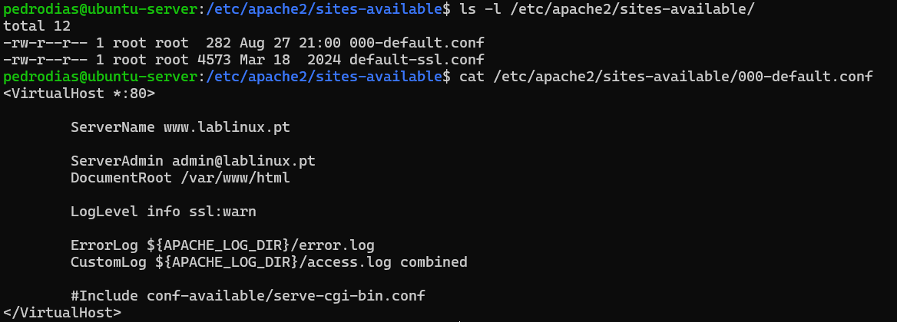

## 1.g)

> Explique como configurar uma interface de rede no Ubuntu Server usando o arquivo de configuração `/etc/netplan/*.yaml`. 
Mostre o arquivo de configuração de IP fixo e os comandos necessários para aplicar a configuração de rede.
Apresente um print do comando `ip a` para verificar a interface configurada.
> 

No Ubuntu Server, a configuração de rede é feita no ficheiro YAML do Netplan. Para definir um IP fixo, edita-se o ficheiro `/etc/netplan/50-cloud-init.yaml` e depois aplica-se a configuração com o comando `netplan`.

Estes são os passos:

```bash
cd /etc/netplan
ls 
sudo nano 50-cloud-init.yaml
```

```yaml
network:
  version: 2
  ethernets:
    enp0s3:
      dhcp4: true
    enp0s8:
      dhcp4: false
      addresses: [192.168.5.1/24]
      routes:
        - to: default
          via: 192.168.5.254
      nameservers:
        addresses: [192.168.5.1, 1.1.1.1, 8.8.8.8]
```

E para aplicar estas alterações:

```yaml
sudo netplan apply
```

E para consultar as alterações na interface, será:

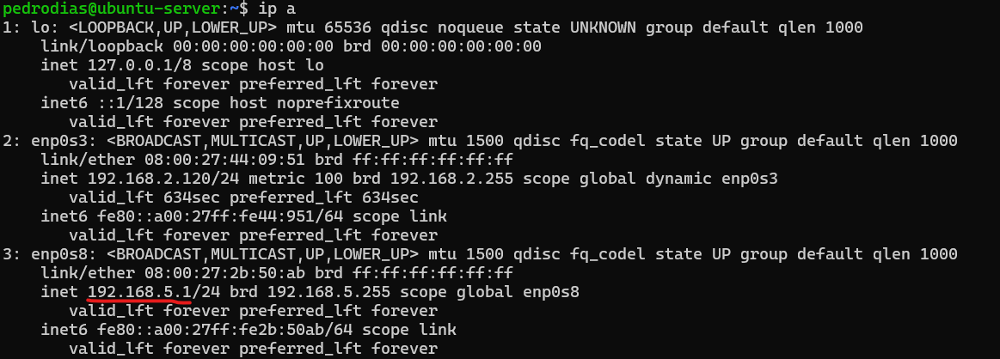

## 1.h)

> Submeta uma captura de ecrã do ficheiro `/etc/bind/named.conf.options`, destacando a configuração do reencaminhamento DNS para os servidores externos.
> 

```bash
ls -l /etc/bind/named.conf.options
cat /etc/bind/named.conf.options
```

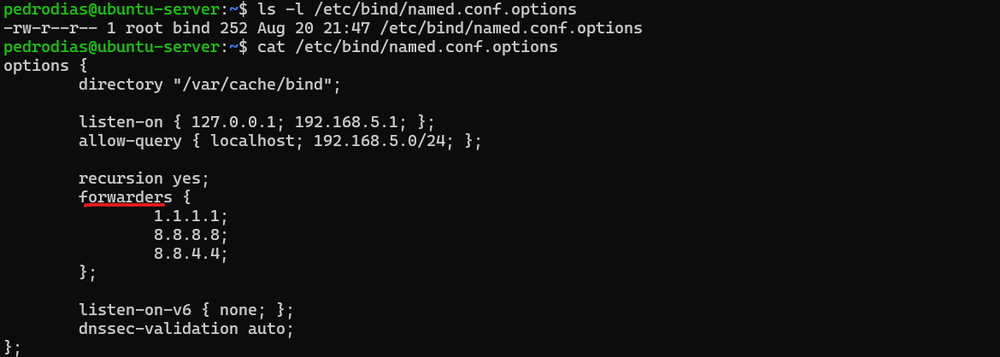

## 1.i)

> Submeta um print da criação de um novo utilizador no servidor Ubuntu com o comando `useradd`. Inclua também o comando utilizado para atribuir uma senha ao utilizador e verifique a criação no ficheiro `/etc/passwd`.
> 

```bash
sudo useradd -m -s /bin/bash joao
sudo passwd joao
grep joao /etc/passwd
ls -l /home
```

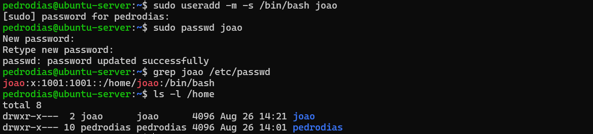

## 1.j)

> Apresente um print da criação de um novo grupo no servidor Ubuntu com o comando `groupadd`.
Em seguida, mostre como adicionar um utilizador ao grupo criado utilizando o comando `usermod`.
Inclua também a verificação da mudança no ficheiro `/etc/group`.
> 

```bash
sudo groupadd projeto
sudo usermod -aG projeto joao
grep projeto /etc/group
```

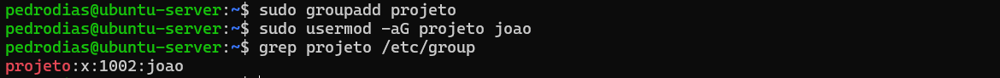

---

---

# Parte 2

> Texto Corrido com Evidências (6 valores)
> 

## 2.a)

> Explique o que são permissões no Linux (rwx) e como estas podem ser ajustadas com o comando `chmod`. Inclua exemplos práticos.
> 

No Linux, cada ficheiro ou diretório tem associadas permissões de acesso que determinam quem pode ler, escrever ou executar esse recurso. 

Estas permissões são representadas pelas letras r (read), w (write) e x (execute).

As permissões aplicam-se a três níveis:

1. **Utilizador (u)** – o dono do ficheiro.
2. **Grupo (g)** – o grupo a que pertence o ficheiro.
3. **Outros (o)** – todos os restantes utilizadores.

Cada nível corresponde a **3 bits** (um para cada permissão r, w, x):

- Bit = **0** → permissão desativada (*off*).
- Bit = **1** → permissão ativa (*on*).

Assim, rwx = 111, rw- = 110, r-- = **100.
Juntando os 3 níveis (u, g, o), obtemos 9 bits no total.

Esses bits podem ser representados de duas formas:

- **Notação simbólica (letras)**, indicando explicitamente o que queremos alterar.
- **Notação numérica (decimal)**, em que cada conjunto de 3 bits é convertido num número (0–7).

Exemplo com letras (simbólico)

```yaml
# Dar execução ao dono
chmod u+x programa.sh

# Remover escrita ao grupo
chmod g-w ficheiro.txt

# Dar leitura a todos
chmod a+r documento.txt
```

Exemplo com valores numéricos

Cada permissão tem um valor:

- r = 4, w = 2, x = 1

A soma dos valores dá o equivalente decimal:

- 7 = rwx (111)
- 6 = rw- (110)
- 5 = r-x (101)
- 4 = r-- (100)

Exemplo:

```bash
touch ficheiro.txt
ls -l ficheiro.txt
chmod 644 ficheiro.txt
ls -l ficheiro.txt

touch programa.sh
ls -l programa.sh
chmod 755 programa.sh
ls -l programa.sh

touch segredo.txt
ls -l segredo.txt
chmod 600 segredo.txt
ls -l segredo.txt
```

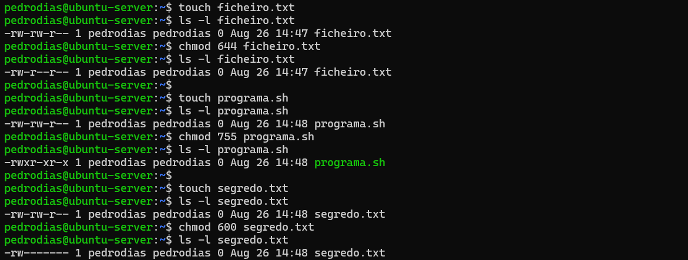

## 2.b)

> Descreva como configurar o servidor DNS no Ubuntu Server usando o BIND9. Mostre a configuração de uma zona de pesquisa direta no arquivo `/etc/bind/named.conf.local` e explique como criar uma zona reversa. Inclua exemplos de configurações de zonas e como testar a resolução
de nomes.
> 

Para configurar um servidor DNS no Ubuntu Server com o BIND9, é necessário instalar o serviço e editar os ficheiros de configuração das zonas.

Etapa 1 será a instalação do bind9

```bash
sudo apt update
sudo apt install bind9 bind9utils bind9-doc -y
```

Etapa 2 é a configuração da zona `forward` e de `reverse` editando o respectovo ficheiro

```bash
sudo nano /etc/bind/named.conf.local
```

E colocar as seguintes instruções:

```
zone "lablinux.pt" IN {
    type master;
    file "/etc/bind/forward.lablinux.pt";
};

zone "5.168.192.in-addr.arpa" IN {
  type master;
  file "/etc/bind/reverse.lablinux.pt";
};
```

Etapa 3 será criar os ficheiros de forward e reverse referido no ficheiro anterior (aproveitando o template já existente `db.empty`).

```bash
sudo cp /etc/bind/db.empty /etc/bind/forward.lablinux.pt
sudo nano /etc/bind/forward.lablinux.pt
```

E alterar para:

```
$TTL    86400
@       IN      SOA     ubuntu-server.lablinux.pt. admin.lablinux.pt. (
                        2025082001 ; Serial
                        604800     ; Refresh
                        86400      ; Retry
                        2419200    ; Expire
                        86400 )    ; Negative Cache TTL

@       IN      NS      ubuntu-server.lablinux.pt.
@       IN      A       192.168.5.1
ubuntu-server IN A      192.168.5.1
www     IN      A      192.168.5.1

```

E repetir para o outro ficheiro (reverse) de forma semelhante:

```bash
sudo cp /etc/bind/db.empty /etc/bind/reverse.lablinux.pt
sudo nano /etc/bind/reverse.lablinux.pt
```

e altera para

```bash
$TTL    86400
@       IN      SOA     ubuntu-server.lablinux.pt. admin.lablinux.pt. (
                        2025082001 ; Serial
                        604800     ; Refresh
                        86400      ; Retry
                        2419200    ; Expire
                        86400 )    ; Negative Cache TTL

@       IN      NS      ubuntu-server.lablinux.pt.
1       IN      PTR     ubuntu-server.lablinux.pt.

```

Etapa 4 será validar a configuração feita.

Ou seja, verificar se há erros antes mesmo de reiniciar o serviço:

```bash
sudo named-checkconf
sudo named-checkzone lablinux.pt /etc/bind/forward.lablinux.pt
sudo named-checkzone 5.168.192.in-addr.arpa /etc/bind/reverse.lablinux.pt
```

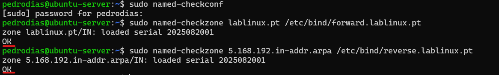

Etapa 5 (se tudo estiver OK no passo anterior) será reiniciar o respectivo serviço

```bash
sudo systemctl restart bind9
sudo systemctl status bind9
```

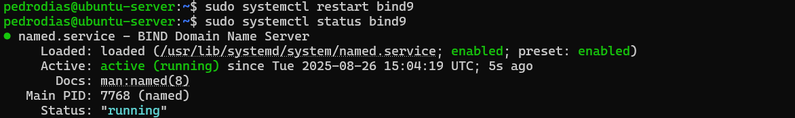

Etapa 6 é testar o acesso

```bash
dig lablinux.pt
dig www.lablinux.pt
dig -x 192.168.5.1
```

## 2.c)

> Descreva como validar que a firewall UFW está ativa e a bloquear conexões indesejadas no servidor Ubuntu. Inclua o comando utilizado e um print da validação.
> 

Para verificar o estado da firewall fazer:

```bash
sudo ufw status verbose
```

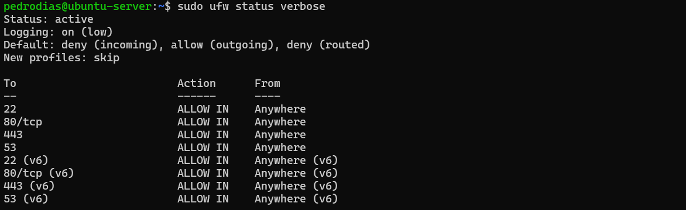

## 2.d)

> Explique como criar utilizadores, grupos e dar permissões específicas a um diretório no servidor Ubuntu. 
Forneça prints do processo (comandos utilizados e estrutura de permissões).
> 

É possível criar utilizadores e grupos e atribuir permissões específicas a diretórios para controlar o acesso.

```bash
sudo groupadd projeto
sudo useradd -m -s /bin/bash -g projeto joao
sudo passwd joao
sudo usermod -aG projeto pedrodias
```

De seguida, é possível criar a pasta e adicioar as permissões para que esse user possa 

```bash
sudo mkdir /dados
sudo usermod -aG projeto joao
sudo usermod -aG projeto pedrodias
sudo chgrp projeto /dados
sudo chmod 770 /dados
ls -ld /dados
cd /dados
exit
...
cd /dados
pwd
thouch ficheiro.txt
ls -l 
```

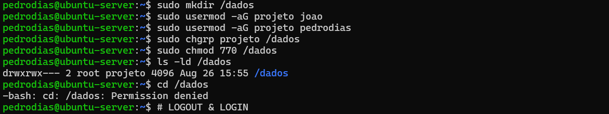

… (e depois de novo login)

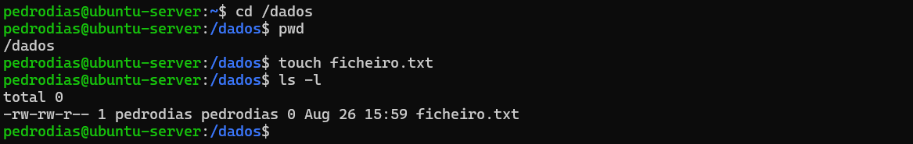

## 2.e)

> Explique como configurar o serviço Apache no servidor Ubuntu para que ele inicie automaticamente após o arranque do sistema. Inclua prints do comando utilizado e do teste que verifica se o serviço está em execução após um reinício.
> 

```bash
sudo apt install apache2 -y > /dev/null 2>&1 # para caber no mesmo print

sudo a2enmod ssl
sudo systemctl start apache2
sudo systemctl enable apache2
sudo systemctl status apache2

curl http://127.0.0.1 -I
```

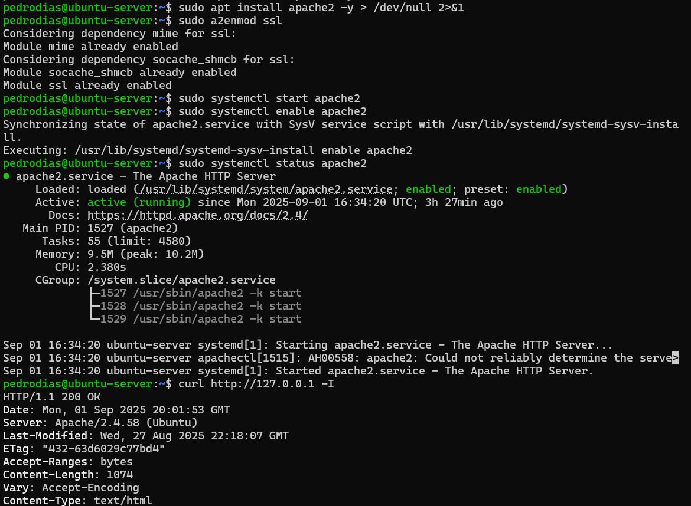

```bash
sudo a2enmod ssl
sudo a2enmod headers
sudo a2ensite default-ssl

sudo apache2ctl configtest
sudo systemctl restart apache2
```

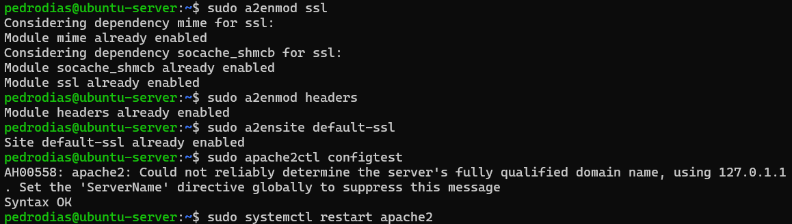

```bash
sudo ufw enable
sudo ufw app list

sudo ufw allow in "OpenSSH"
sudo ufw allow in "Bind9"
sudo ufw allow in "Apache Full"
...
sudo ufw app info "Apache Full"
```

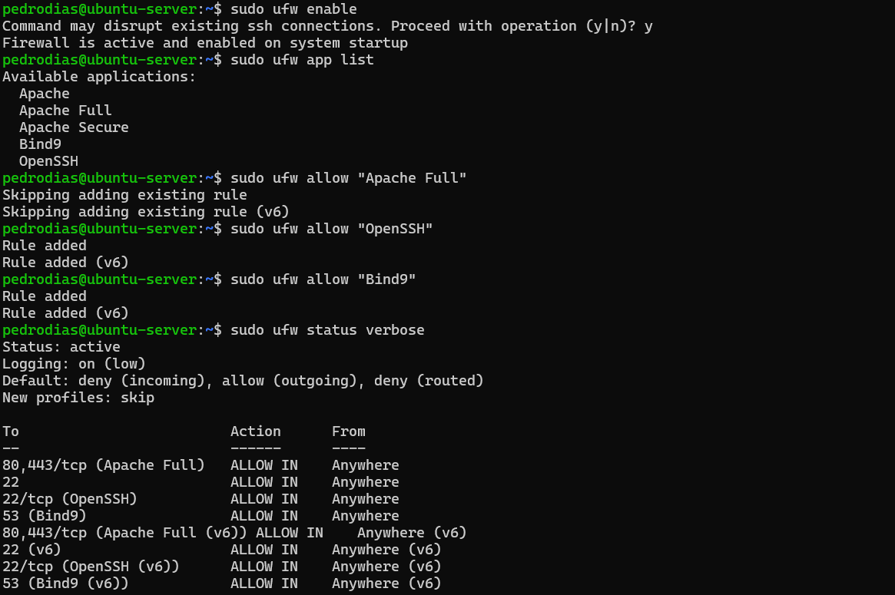

## 2.f)

> Descreva o processo para verificar o estado de um serviço no Ubuntu utilizando o comando systemctl status. Apresente um exemplo de como verificar o estado do serviço Apache e os resultados obtidos.
> 

No Ubuntu, os serviços são geridos pelo systemd através do comando `systemctl`. Para verificar o estado de um serviço em execução, utiliza-se:

```bash
systemctl status <nome-do-serviço>
```

Para verificar o estado do Apache2

```bash
systemctl status apache2
```

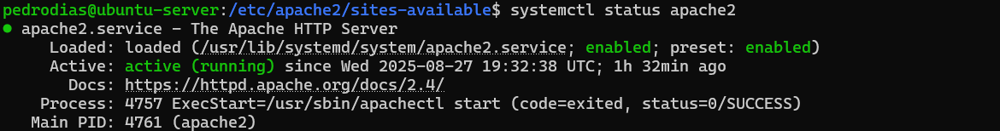

---

---

# Parte 3

> Escolha Múltipla (4 valores)
> 

## 3.1

> Qual é o processo correto para instalar e configurar o servidor Apache no Ubuntu Server?
Assinale a opção que descreve corretamente os passos.
> 

**a)**

1. Instalar o Apache com o comando sudo apt install apache2.
2. Editar o arquivo /etc/apache2/sites-available/000-default.conf para configurar o site.
3. Reiniciar o serviço Apache com o comando sudo systemctl restart apache2.
4. Testar a configuração acessando o servidor com um navegador no endereço [http://localhost](http://localhost/).

b) 

1. Instalar o Apache com o comando sudo apt-get install apache.
2. Editar o arquivo /etc/apache2/apache2.conf para configurar o site.
3. Reiniciar o serviço Apache com o comando sudo systemctl stop apache2.
4. Testar a configuração acessando o servidor com um navegador no endereço [http://127.0.0.1](http://127.0.0.1/).

c) 

1. Instalar o Apache com o comando sudo apt install apache2.
2. Editar o arquivo /etc/apache2/sites-available/000-default.conf para configurar o site.
3. Reiniciar o serviço Apache com o comando sudo systemctl restart apache2.
4. Testar a configuração acessando o servidor com um navegador no endereço [http://127.0.0.1](http://127.0.0.1/).

d) 

1. Instalar o Apache com o comando sudo apt-get apache2.
2. Editar o arquivo /etc/apache2/sites-enabled/000-default.conf para configurar o site.
3. Reiniciar o serviço Apache com o comando sudo service apache2 start.
4. Testar a configuração acessando o servidor com um navegador no endereço [http://localhost](http://localhost/).

> RESPOSTA: Opção c)
> 

## 3.2

> O que faz o comando systemctl enable apache2?
> 

a) Reinicia o serviço Apache2.
b) Ativa o serviço Apache2 para iniciar automaticamente no arranque.
c) Mostra o estado atual do Apache2.
d) Instala o serviço Apache2.

> RESPOSTA: Opção b)
> 

## 3.3

> Qual a principal função do servidor DHCP no laboratório?
> 

a) Monitorizar serviços de rede.
b) Atribuir endereços IP automaticamente aos clientes.
c) Gerir backups do sistema.
d) Servir como servidor DNS.

> RESPOSTA: Opção b)
> 

## 3.4

> O que faz o comando ufw allow 22/tcp no Ubuntu Server?
> 

a) Abre a porta 22 para todos os protocolos.
b) Permite tráfego TCP na porta 22, usado para SSH.
c) Configura o SSH para iniciar automaticamente no arranque.
d) Bloqueia a porta 22 para o tráfego externo.

> RESPOSTA: Opção b)
> 

---

---

# Extras: Ubuntu Desktop

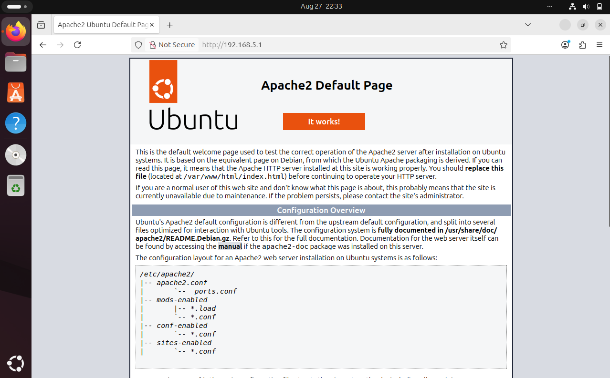

# Extra: pfSense

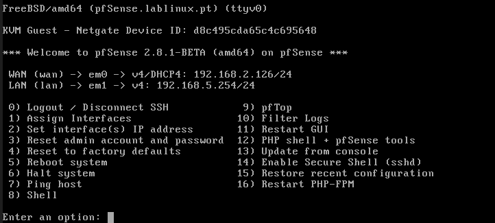

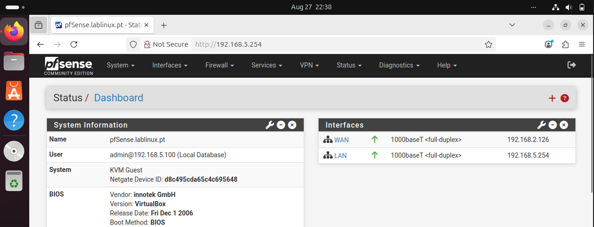